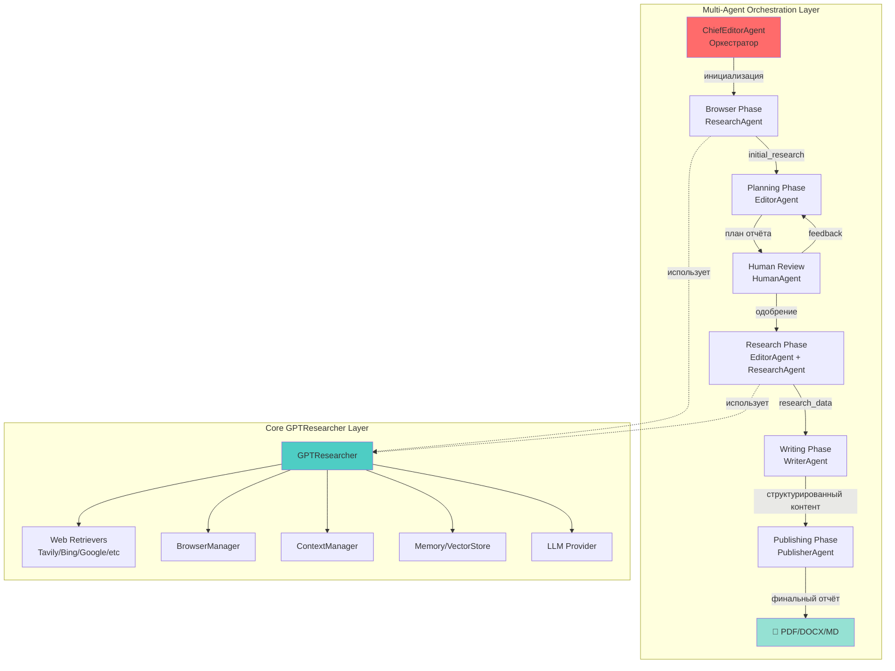
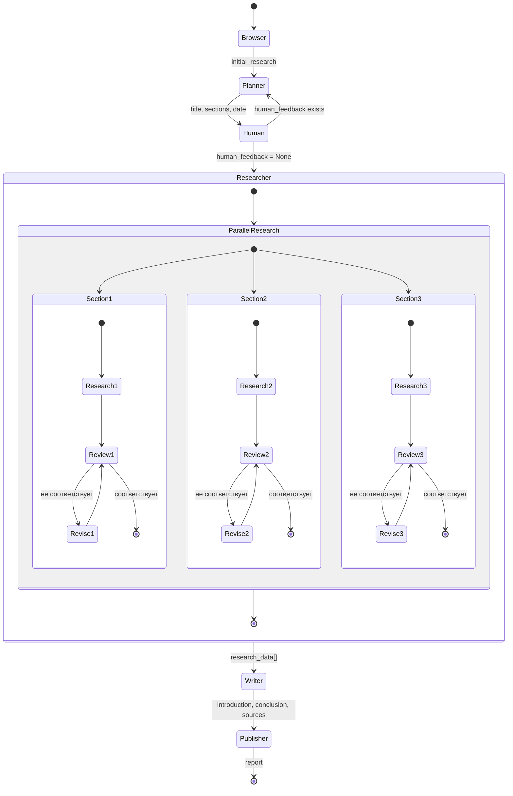
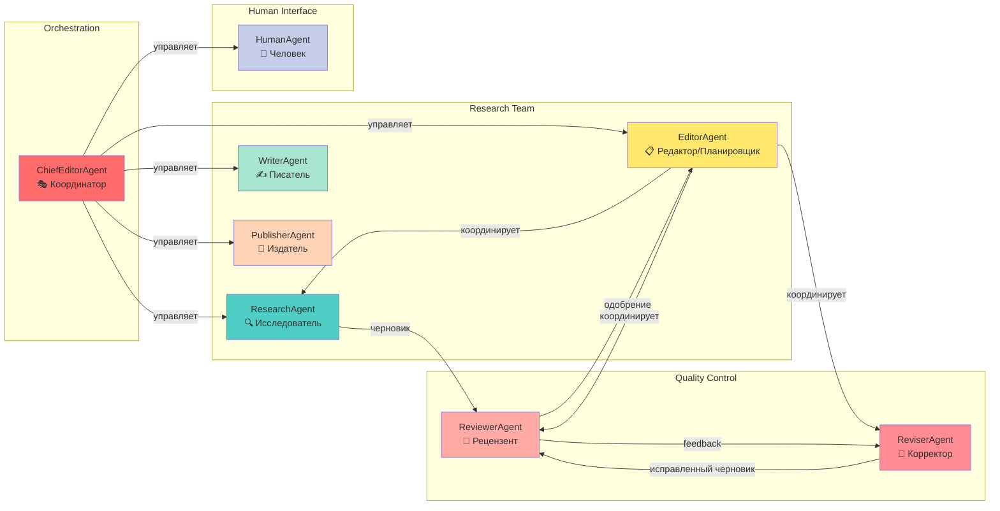
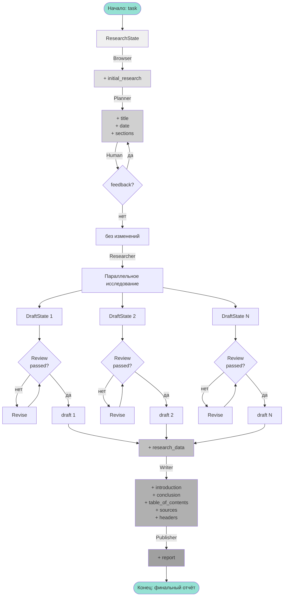
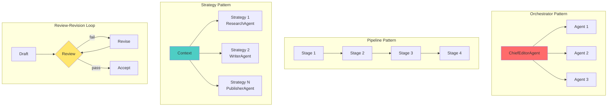
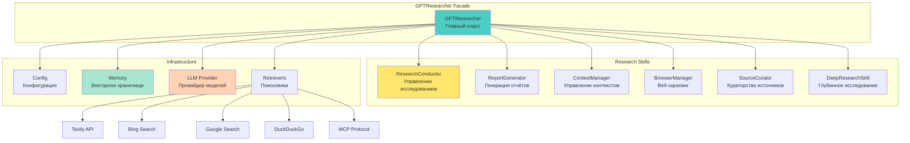
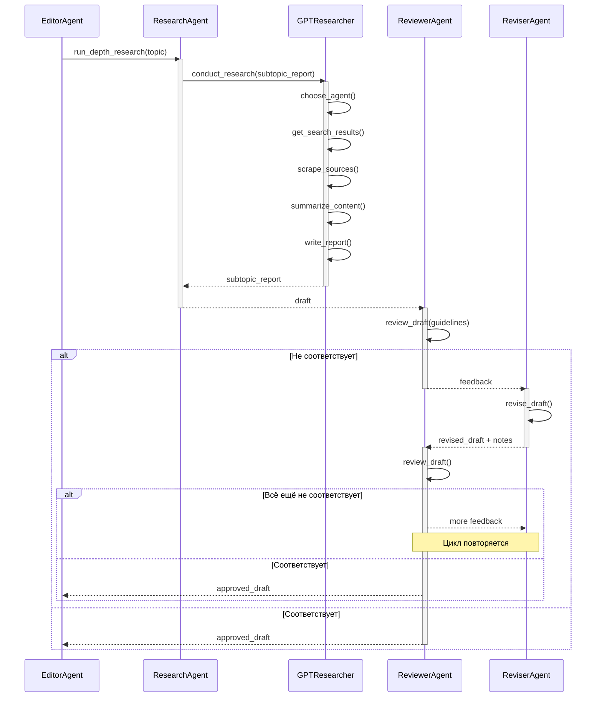
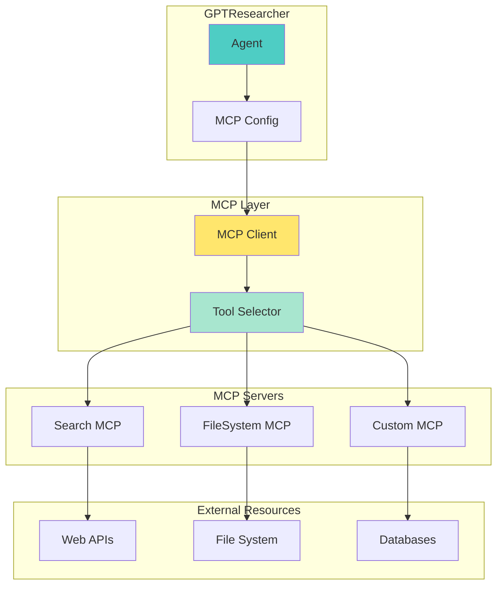

# Диаграммы архитектуры GPT-Researcher Multi-Agent System

## 1. Общая архитектура системы

## 2. Workflow с управлением состоянием (LangGraph StateGraph)

## 3. Архитектура агентов и их взаимодействие

## 4. Поток данных через состояния

## 5. Паттерны проектирования

## 6. GPTResearcher Core Architecture

## 7. Детальный процесс исследования одной секции

## 8. MCP (Model Context Protocol) Integration

## Примечания к диаграммам

### Условные обозначения:
- **Синие блоки** — основные компоненты (ChiefEditorAgent, GPTResearcher)
- **Жёлтые блоки** — агенты планирования и координации
- **Зелёные блоки** — агенты генерации контента
- **Красные/оранжевые блоки** — агенты контроля качества
- **Фиолетовые блоки** — человеческий интерфейс
- **Сплошные стрелки** — прямые вызовы/переходы
- **Пунктирные стрелки** — использование/зависимость

### Ключевые особенности архитектуры:

1. **Двухуровневая структура:** Оркестрационный слой (multi-agents) над базовым слоем (gpt-researcher)
2. **Параллельная обработка:** Секции исследуются одновременно для ускорения
3. **Циклы обратной связи:** Review-Revision loops обеспечивают качество
4. **Управление состоянием:** LangGraph StateGraph координирует поток данных
5. **Модульность:** Каждый агент — независимый модуль с чёткой ответственностью
